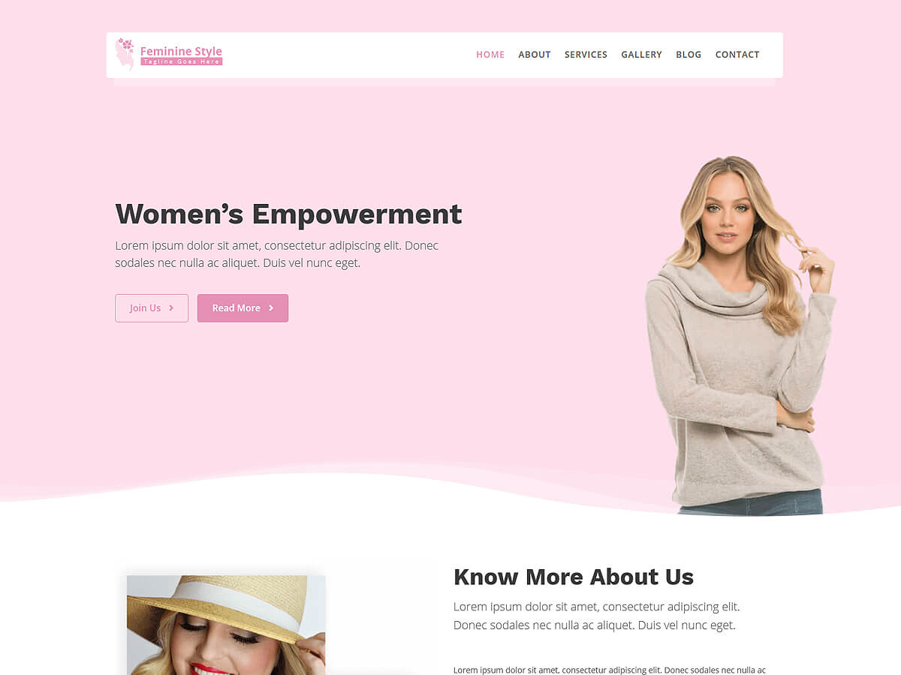

# Feminine Style

**Contributors:** acmethemes  
**Requires at least:** 6.6  
**Tested up to:** 7.0  
**Requires PHP:** 7.4  
**Stable tag:** 4.0.0  
**License:** GPLv2 or later  
**License URI:** https://www.gnu.org/licenses/gpl-2.0.html  

> 

Feminine Style is a voguish, elegant WordPress theme designed for and inspired by modern women. Whether you're building a lifestyle blog, a fashion portfolio, a personal brand site, or an online boutique, its stylish design and versatile feature set make it a perfect canvas for your voice and vision.

## Features

- **Up to four-column layouts** — flexible grids for galleries, products, and posts
- **Featured slider** — showcase your best content with style
- **Page builder compatible** — works with Elementor, Beaver Builder, SiteOrigin
- **Post formats** — standard, gallery, image, and video
- **WooCommerce compatible** — sell products, digital downloads, or services
- **Custom colors & background** — create your perfect palette
- **Custom logo & menu** — full branding control
- **Footer widgets** — links, social, and contact info
- **Editor-style support** — what you see is what you get
- **Translation ready** — .pot file included
- **RTL support** — right-to-left language compatible
- **Responsive** — flawless on phones, tablets, and desktops

## Installation

1. Download the theme zip file.
2. In your WordPress admin, go to **Appearance → Themes**.
3. Click **Add New** → **Upload Theme**.
4. Select the zip file and click **Install Now**.
5. Click **Activate**.

## Frequently Asked Questions

### How do I install the theme?

In your admin panel, go to **Appearance → Themes**, click **Add New**, upload the zip file, and click **Activate**.

### How do I customize the theme?

Go to **Appearance → Customize** — all settings for layout, colors, featured section, and widgets are right there.

## Credits

Feminine Style is built on [Underscores](https://underscores.me/) and licensed under GPLv2 or later. It bundles the following third-party resources:

- [Google Fonts](https://fonts.google.com/) — Apache License 2.0
- [Font Awesome](https://fontawesome.com/) — MIT / SIL OFL 1.1
- [normalize.css](https://necolas.github.io/normalize.css/) — MIT
- [Bootstrap](http://getbootstrap.com/) — MIT
- [Theia Sticky Sidebar](https://github.com/WeCodePixels/theia-sticky-sidebar) — MIT
- [Breadcrumb Trail](https://github.com/justintadlock/breadcrumb-trail) — GPLv2+
- [TGM Plugin Activation](http://tgmpluginactivation.com/) — GPLv2+
- [html5shiv](https://github.com/afarkas/html5shiv) — MIT
- [Respond.js](https://github.com/scottjehl/Respond) — MIT

---

[Support](https://www.acmethemes.com/supports/) &middot; [Acme Themes](https://www.acmethemes.com)
